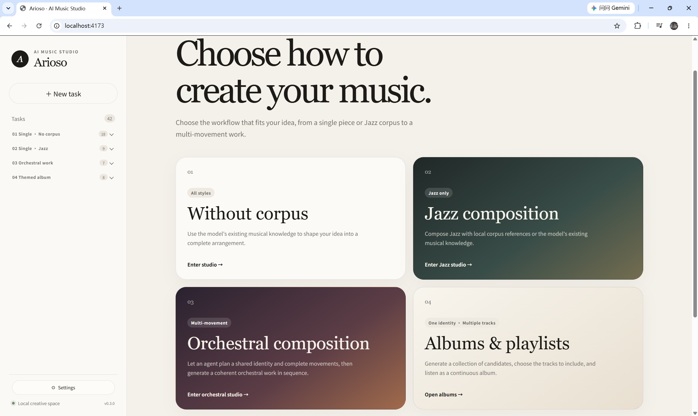
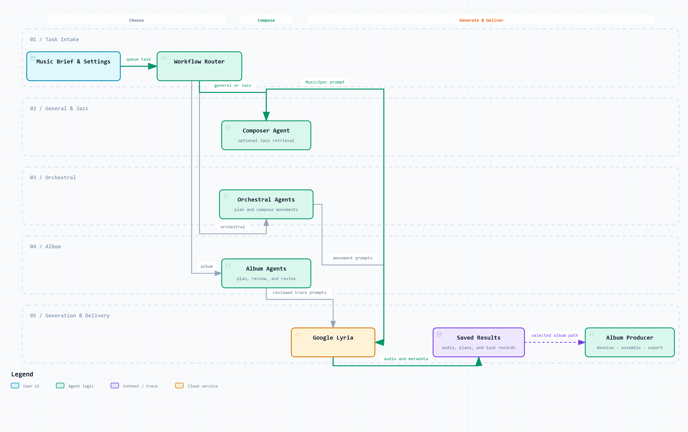

# Arioso

Arioso is a local workspace for agent-directed music composition. It turns a
musical idea into a structured plan, uses optional corpus knowledge to refine
that plan, and can send the resulting prompt to Google Lyria for audio
generation.

Arioso now supports four workflows through a bilingual browser interface
and a command-line interface:

- general composition from a free-form brief;
- Jazz composition with local corpus retrieval;
- coherent multi-movement orchestral works; and
- multi-track albums with candidate review, playlist ordering, playback, and
  MP3 export.

## Interface



## Workflow



## Example output

Listen to [Afternoon Study](https://www.bilibili.com/video/BV1p5pc6AEX2/), a
complete piece generated with Arioso.

## Requirements

- Windows or macOS;
- Node.js 22 or newer;
- pnpm 11.19.0, as declared in `package.json`;
- an OpenAI API key for composition; and
- a Gemini API key with Lyria access for audio generation.

The core web and CLI workflows support Windows and macOS. The optional
historical-denoising production workflow currently supports Windows only.
macOS users can still compose and generate album candidates, manage playlists,
and export their selected tracks without denoising.

## Quick start

```shell
git clone https://github.com/666feiyu666/Arioso.git
cd Arioso
corepack enable
pnpm install --frozen-lockfile
pnpm web
```

Open <http://127.0.0.1:4173> and configure the required API keys in Settings.

If Corepack is unavailable, install pnpm 11.19.0 separately before running
`pnpm install`.

## Command line

For CLI use, copy `.env.example` to `.env` and replace the placeholders:

```powershell
# Windows PowerShell
Copy-Item .env.example .env
```

```shell
# macOS
cp .env.example .env
```

Then run one of the supported commands:

```shell
pnpm dev compose "A quiet nocturne for piano and muted trumpet."
pnpm dev generate "A quiet nocturne for piano and muted trumpet."
pnpm dev produce-album "A calm instrumental album for late-night reading."
pnpm dev stitch "album.mp3" "part-1.mp3" "part-2.mp3"
```

`produce-album` includes the Windows-only denoising production stage. Use the
browser's standard album workflow on macOS.

## Verification

```shell
pnpm typecheck
pnpm test
pnpm build
```

See [`docs/development.md`](docs/development.md) for development commands and
[`pipeline/USAGE.md`](pipeline/USAGE.md) for the optional Windows production
pipeline.
